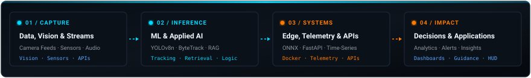

<!-- ═══ HEADER & HERO ═══ -->
<div align="center">


<br/><br/>

# IVINE P SABU

### AI Engineer &nbsp;·&nbsp; Machine Learning &nbsp;·&nbsp; Data Science &nbsp;·&nbsp; Applied AI

<a href="https://github.com/IvinePannivelil"></a>

<br/>

[](#-work-experience)
[](#-about--background)
[](#-featured-projects)

</div>

<br/>

---

<!-- ═══ ENGINEERING PIPELINE VISUAL ═══ -->
<div align="center">

 Vision & Applied AI -> Edge, Telemetry & APIs -> Decisions & Applications" />

</div>

<br/>

<!-- ═══ PROFESSIONAL POSITIONING ═══ -->
## 🎯 About &amp; Background

My background is in **Artificial Intelligence & Data Science**, and I currently work as an **AI Engineer at Goose Industrial Solutions Pvt. Ltd.** I am focused on building deeper technical capability across machine learning, data-driven systems, applied AI, and real-world intelligent applications.

My current role has given me broad, practical engineering exposure across industrial data streams, monitoring dashboards, telemetry architectures, computer vision pipelines, and applied R&D. Working with physical systems reinforced an engineering-first mindset: models in notebooks are only the beginning—real impact comes from building systems that hold up under latency limits, data quality challenges, reliability requirements, and operational constraints.

> **"I care about systems that hold up under real constraints: latency, data quality, reliability, and actual usability."**

- 🔭 **Current Direction:** Building deeper capability in machine learning, data science, and applied AI, with strong technical focus areas in **Computer Vision, GenAI / RAG, and Time-Series Analytics**.
- 🏎️ **Long-Term Curiosity:** Outside of software, I'm passionate about mechanical systems, vehicle dynamics, and performance engineering. Long-term, I'm particularly interested in where machine learning, perception, and intelligent systems intersect with physical machines and automotive technology.

<br/>

---

<!-- ═══ WORK EXPERIENCE ═══ -->
## 💼 Work Experience

#### **AI Engineer** — *Goose Industrial Solutions Pvt. Ltd.*
`Applied AI` &nbsp;·&nbsp; `Machine Learning` &nbsp;·&nbsp; `Data Systems` &nbsp;·&nbsp; `Computer Vision` &nbsp;·&nbsp; `R&D`

- **Industrial Data & Monitoring:** Developed and evaluated edge-to-dashboard telemetry systems connecting factory-floor equipment to time-series data stores, analytical dashboards, and monitoring interfaces.
- **Applied AI & Diagnostics R&D:** Prototyped a multi-agent RAG troubleshooting architecture to assist maintenance technicians with equipment failure diagnosis and technical documentation retrieval.
- **Computer Vision & Inspection:** Contributed to vision pipelines for production inspection, object tracking, and throughput telemetry on packaging and conveyor lines.
- *This role broadened my practical engineering exposure across live data environments and reinforced my focus on building deeper capability in machine learning, data science, and applied AI systems.*

<br/>

---

<!-- ═══ FEATURED PROJECTS ═══ -->
## 🛠️ Featured Projects

### 01 / [Industrial Conveyor Vision Analytics](https://github.com/IvinePannivelil/Industrial-Conveyor-Vision-Analytics)
> **Real-time computer vision and analytics pipeline for multi-object tracking, directional line counting, production throughput analytics, and model reliability diagnostics.**

[](https://github.com/IvinePannivelil/Industrial-Conveyor-Vision-Analytics)
[](https://github.com/IvinePannivelil/Industrial-Conveyor-Vision-Analytics)
[](https://github.com/IvinePannivelil/Industrial-Conveyor-Vision-Analytics)

- **Tracking & Counting Architecture:** Extends baseline single-frame detection into an end-to-end tracking pipeline using ByteTrack with persistent object IDs, anti-jitter trajectory raycasting, and directional virtual-line crossing (UP/DOWN counts).
- **Data Science & Production Analytics:** Computes dynamic time-window throughput metrics, statistical aggregation, average production rate (units/min), and distribution charts from persistent local event telemetry (`count_events.csv`) without requiring external database dependencies.
- **Model Reliability Lab & Error Analysis:** Empirical failure-mode evaluation suite featuring false-positive suppression, confidence calibration curves, hard-negative mining, and temporal leakage prevention.
- **Interactive Control Suite & Simulator:** Built-in procedural conveyor simulation engine running locally with zero external weight downloads, verified by **34 automated tests passing** across tracking, counting, and aggregation.
*(Note: The baseline detector was developed separately as part of team work; my portfolio contribution focuses on the downstream tracking pipeline, telemetry, analytics, simulator, reliability engineering, and evaluation suite).*

```
Stack: Python · YOLOv8n · ByteTrack · OpenCV · ONNX Runtime · Data Analytics · PyTest · Telemetry CSV
```

---

### 02 / [Multi-Agent Industrial Troubleshooting AI](https://github.com/IvinePannivelil/multi-agent-industrial-troubleshooting-ai)
> **Applied AI diagnostic assistant and procedural guidance platform combining multi-agent coordination, intent classification, and hybrid RAG retrieval.**

[](https://github.com/IvinePannivelil/multi-agent-industrial-troubleshooting-ai)
[](https://github.com/IvinePannivelil/multi-agent-industrial-troubleshooting-ai)
[](https://github.com/IvinePannivelil/multi-agent-industrial-troubleshooting-ai)

- **Applied AI & Intent Classification:** Implemented a two-pass intent router combining deterministic regex rules for zero-latency safety commands with an LLM fallback classifier for complex diagnostic inquiries.
- **Specialist Agent Routing & Knowledge Systems:** Coordinates domain-specific agents—strict decision-tree troubleshooting, hardware parts recommendation, technician training curriculum lookup, and standard SOP guidance.
- **System Architecture:** Modular monorepo with a FastAPI backend coordination engine, vector knowledge base with hybrid RAG retrieval (Pinecone), and an interactive Next.js technician web portal.
*(Note: Prototyped as an internal R&D concept during work at Goose Industrial Solutions; architecture and implementation are personal work published with permission).*

```
Stack: Python · FastAPI · Multi-Agent RAG · Intent Routing · Pinecone Vector DB · Next.js · TypeScript
```

---

### 03 / [IIoT Dairy Monitoring Dashboard](https://github.com/IvinePannivelil/iiot-dairy-monitoring-dashboard)
> **Real-world industrial data platform and telemetry dashboard with time-series analytics and predictive sensor forecasting, built on-site for a live dairy plant.**

[](https://github.com/IvinePannivelil/iiot-dairy-monitoring-dashboard)
[](https://github.com/IvinePannivelil/iiot-dairy-monitoring-dashboard)
[](https://github.com/IvinePannivelil/iiot-dairy-monitoring-dashboard)

- **Time-Series Data & Edge Architecture:** Bridges factory-floor Siemens S7 PLCs via Node-RED (ISO-on-TCP RFC 1006) directly into InfluxDB 2.7 time-series storage, served by a high-throughput FastAPI backend to an interactive React dashboard.
- **Sensor Analytics & Predictive Forecasting ("Ghost Line"):** Implemented a lightweight regression forecasting module that projects key temperature and pressure sensor trends 5–10 minutes ahead, demonstrating early warning before process limits are exceeded.
- **Operational Analytics & Reliability:** Features full alarm lifecycle management (acknowledgments, severity routing), three operating modes (Live PLC, Offline Historian, Simulation Engine), and containerized edge deployment on ARM64 gateways.
*(Note: Built collaboratively on-site with Rasal; focuses on industrial telemetry, historian integration, and dashboard engineering).*

```
Stack: FastAPI · InfluxDB 2.7 · Time-Series Analytics · Siemens S7 PLC · Node-RED · React · Docker · Python
```

---

### 04 / [Smart Glasses — Real-Time Transcribing HUD](https://github.com/IvinePannivelil/Smart-Glasses-Real-Time-Transcribing-Glasses)
> **Assistive wearable speech-to-text heads-up display streaming live captions over BLE to spectacles.**

[](https://github.com/IvinePannivelil/Smart-Glasses-Real-Time-Transcribing-Glasses)
[](https://github.com/IvinePannivelil/Smart-Glasses-Real-Time-Transcribing-Glasses)
[](https://github.com/IvinePannivelil/Smart-Glasses-Real-Time-Transcribing-Glasses)

- **End-to-End System Pipeline:** Captures ambient live audio via a Flutter mobile application, performs speech transcription via device STT services, and packetizes subtitles across custom Bluetooth Low Energy (BLE) GATT characteristics.
- **Embedded HUD Micro-Display:** Engineered C++ firmware on an ESP32 microcontroller mounted on glasses frames, rendering real-time scrolling captions on an ultra-lightweight SSD1306 OLED display with optimized frame buffering.

```
Stack: Flutter · Dart · ESP32 · BLE (Bluetooth Low Energy) · C++ / Arduino · SSD1306 OLED
```

<br/>

<details>
<summary><strong>📂 Earlier &amp; Academic Projects</strong></summary>

<br/>

- **[JIVA — Job Seeking Mobile Application](https://github.com/IvinePannivelil/JIVA-Job-Seeking-App)**  
  *Flutter · Firebase · Dart*  
  Mobile application developed as a college internship project for discovering employment listings, application lifecycle tracking, and local applicant profiles.

</details>

<br/>

---

<!-- ═══ TECHNICAL STACK ═══ -->
## ⚙️ Technical Skills &amp; Systems

| Domain | Core Technologies &amp; Tooling |
| :--- | :--- |
| **AI & Machine Learning** | `Python` · `PyTorch` · `scikit-learn` · `Ultralytics YOLOv8` · `Model Evaluation` |
| **Data Science & Analytics** | `Pandas` · `NumPy` · `SQL` · `Exploratory Data Analysis (EDA)` · `Time-Series Analysis` |
| **Applied AI / GenAI** | `Multi-Agent RAG` · `FastAPI` · `Pinecone` · `Intent Routing` · `Retrieval Systems` |
| **Computer Vision** | `OpenCV` · `ByteTrack` · `ONNX Runtime` |
| **Software & Systems** | `Docker` · `Git` · `Automated Testing / PyTest` · `React` · `Next.js` |
| **Edge & Embedded** | `ESP32 Embedded C++` · `BLE (Bluetooth Low Energy)` · `Flutter` · `InfluxDB 2.7` · `Node-RED` |

<br/>

---

<!-- ═══ OFF THE CLOCK / PERSONALITY ═══ -->
## 🏎️ Off the Clock

> *"The same road that gets you home faster is the one worth taking the long way on."*

Outside of machine learning and production code, I'm drawn to mechanical systems and machines in motion:

- 🏍️ **Automotive & Tuning:** JDM culture, superbikes, performance modifications, and track machines. Long-term fascination with vehicle dynamics and where machine learning & perception meet automotive engineering.
- 🛣️ **The Long Way:** High-altitude mountain passes, weekend road trips, and exploring technical roads.
- 🎌 **Downtime:** Sci-fi cinema, anime, and late-night architectural deep-dives.

<br/>

---

<!-- ═══ CONNECT ═══ -->
## 🔗 Connect &amp; Collaborate

<div align="center">

[](https://www.linkedin.com/in/ivine-pannivelil)
&nbsp;&nbsp;
[](mailto:ivine3585@gmail.com)
&nbsp;&nbsp;
[](https://github.com/IvinePannivelil)

<br/>

<sub>💼 Resume available upon request &nbsp;·&nbsp; Interested in opportunities across AI Engineering, Machine Learning, Data Science &amp; Applied AI</sub>

<br/><br/>

`◈ BETTER MODELS · RELIABLE SYSTEMS · REAL-WORLD IMPACT ◈`

</div>
